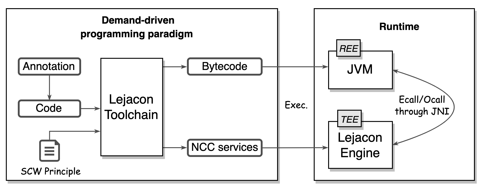

# Lejacon
This repository contains the dataset used in the evaluation of Lejacon.

## Introduction
<div  align="center">    

</div>

[//]: # (![]&#40;docs/images/arch_overview.png&#41;)
Intel SGX is a promising confidential computing technique and popular in the development of confidential cloud services.
As numerous cloud applications are written in Java, which is not inherently supported by the SGX enclave,
state-of-the-art approaches deploy JVMs in enclaves to support Java confidential computing.
This workaround suffers from limitations such as large TCB size and heavy overheads of running JVMs in enclaves.

We propose Lejacon that provides a lightweight and efficient approach to Java confidential computing on SGX:
given a Java application, Lejacon
(1) separately compiles its confidential computing tasks into a bundle of Native Confidential Computing (NCC) services;
(2) runs the NCC services in enclaves on the Trusted Execution Environment (TEE) side, and meanwhile run the non-confidential code on a JVM on the Rich Execution Environment (REE) side.
The two sides interact with each other, protecting confidential computing tasks and as well keeping the Trusted Computing Base (TCB) size small.


## Dataset
The dataset contains 4 mini applications (app): `app-print`, `app-digest`, `app-rsa` and `app-sqlparser`.
It also contains 6 BouncyCastle core-test (ct) benchmarks: `ct-asn1`, `ct-i18n`, `ct-util`, `ct-math`, `ct-pqc`, and `ct-crypto`.

The dependencies of applications/programs can be checked in the [pom](pom.xml) file.
Specifically, the ct benchmarks are synthesized from 254 core tests in the BouncyCastle cryptography library; a subset of the 
BouncyCastle APIs is included and packaged into [bouncycastle-core-ut-4lejacon-1.0.jar](bouncycastle-core-ut-4lejacon-1.0.jar).

### Service Functionality
Each application/program in the dataset provides 1~168 starting confidential methods that are called in the form of service requests.
Each program in [this directory](src/main/java/edu/lejacon/services)
summarizes the confidential method(s) of the corresponding benchmark into a `run` method, to display the functionalities of the service more intuitively.

### Service Example
An example of Hash service using BouncyCastle APIs.
#### HashService.java (in TEE)
```java
package edu.lejacon.example.enclave;
import edu.lejacon.enclave.annotations.EnclaveService;

@EnclaveService
public interface HashService {
    String getHashValue(String alg, String message);
}
```
#### HashServiceImpl.java (in TEE)

```java
package edu.lejacon.example.enclave;

import org.bouncycastle.jce.provider.BouncyCastleProvider;

import java.security.MessageDigest;
import java.security.Provider;
import java.security.Security;

public class HashServiceImpl implements HashService {
    private final Provider PROVIDER;

    public HashServiceImpl() {
        Provider provider = Security.getProvider("BC");
        if (provider != null) PROVIDER = provider;
        else PROVIDER = new BouncyCastleProvider();
        Security.addProvider(PROVIDER);
    }

    @Override
    public String getHashValue(String alg, String message) {
        String result;
        if (message == null) return "Null message!";
        byte[] msgBytes = message.getBytes();
        try {
            MessageDigest md = MessageDigest.getInstance(alg, "BC");
            System.out.println(alg + " provider: " + md.getProvider());
            result = doHash(md, msgBytes);
        } catch (Exception e) {
            System.out.println(e);
            result = "Unsupported hash algorithms!";
        }
        return result;
    }

    private String doHash(MessageDigest md, byte[] msgBytes) {
        md.update(msgBytes);
        return bytesToHex(md.digest());
    }

    private String bytesToHex(byte[] hash) {
        StringBuilder hexString = new StringBuilder(2 * hash.length);
        for (byte b : hash) {
            String hex = Integer.toHexString(0xff & b);
            if (hex.length() == 1) hexString.append('0');
            hexString.append(hex);
        }
        return hexString.toString();
    }
}
```
#### App.java (in REE)
```java
package edu.lejacon.example.host;

import java.util.Iterator;
import java.io.IOException;
import java.nio.file.*;
import edu.lejacon.example.enclave.HashService;
import edu.lejacon.enclave.Enclave;
import edu.lejacon.enclave.EnclaveFactory;

public class App {
    private static String readUsingFiles(String fileName) {
        try {
            return new String(Files.readAllBytes(Paths.get(fileName)));
        } catch (IOException e) {
            e.printStackTrace();
            return null;
        }
    }
    public static void main(String[] args) throws Exception {
        String fpath = args[1];
        String alg = args[0];
        String message = readUsingFiles(fpath);
        Enclave enclave = EnclaveFactory.create();
        Iterator<HashService> services = enclave.load(HashService.class);
        while (services.hasNext()) {
            HashService service = services.next();
            System.out.println("request service: " + alg);
            String result = service.getHashValue(alg, message);
            System.out.println(result);
        }
        enclave.destroy();
    }
}
```
In this example, `HashService` is compiled into the Native Confidential Computing (NCC) service.
The `getHashValue` method is a starting confidential method that can be called through ECall.
`getHashValue` is executed in the TEE side, as well as the call chain inside such as [`doHash` &rarr; `bytesToHex`].  

#### Demo
A demo of running the above Hash service on OcclumJ (_left_) and Lejacon (_right_).

<center class="half">

 

</center>